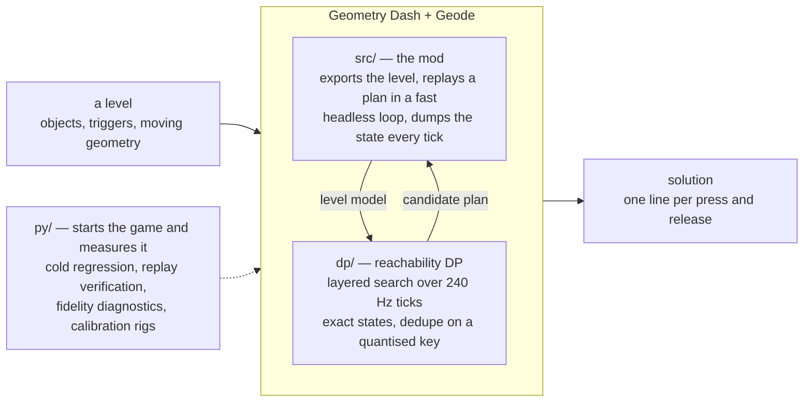
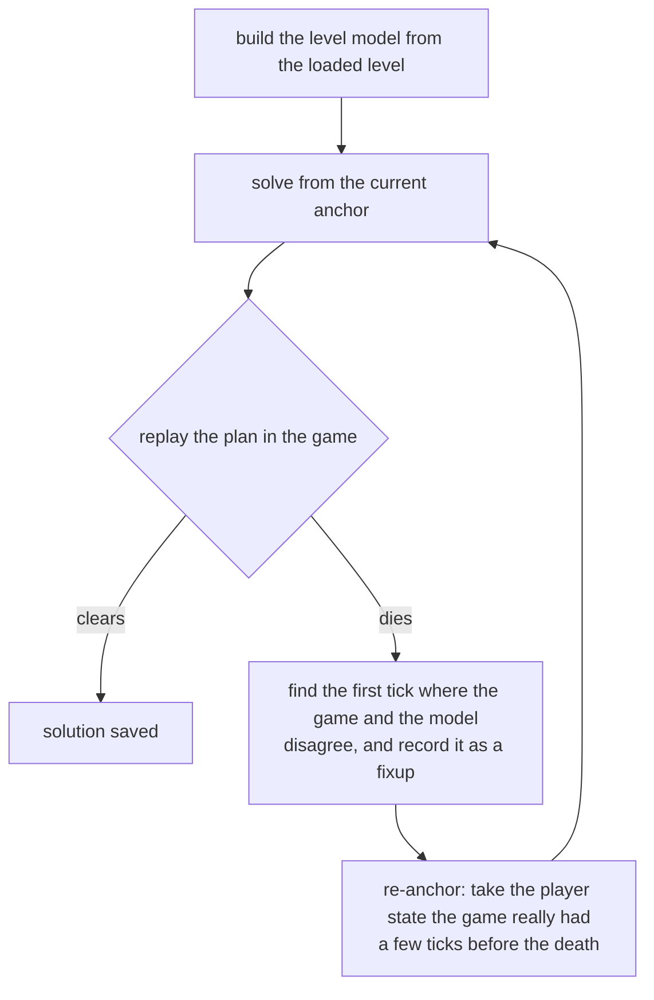

# gdsolver

**An automatic TAS solver for Geometry Dash** (2.2081, Windows / Steam). It
solves a level by playing it — inside the game, from cold.

<p align="center">
  
</p>

<p align="center"><sub>
  The last five seconds of solving <b>Dash</b>, then the first seven of the
  replay. The overlay is the loop's own: which round it is on, how far the best
  plan has reached, how far the search has got. The screen is dark because the
  search is running — the frames go to the fast loop instead — and it comes back
  when a candidate has actually cleared.
</sub></p>

Give it a level and it finds an input sequence that clears it. It does not
re-implement the game's physics: an approximate, measured-where-it-matters model
drives a **reachability DP** (which `(y, velocity)` states are reachable at every
physics tick), and the game itself — running inside a **Geode mod** — is the
verifier that decides whether a candidate plan really clears. Where the replay
diverges from the model, the solver re-anchors on the game's own state and
continues from there.

**All 22 official levels are solved cold** — no seeds, no previous solutions, no
external ground truth — by the loop inside the game, with nothing installed but
Geometry Dash, Geode and this mod. Pick **Solve** on the panel and it builds the
level, searches, replays the candidate, and repairs the plan wherever the game
disagrees with it; no external process is involved. Most levels take under a
minute. The solutions are tracked in [`data/`](data/) as
`solution_lv<N>_dp.txt`, one `input=<tick>,<0|1>` line per press or release.

**With all three coins, too.** Switch **Coins** on in the panel and the goal
becomes the end of the level *and* every coin in it. All 22 official levels are
solved that way as well, cold, and each of those solutions replays to a clear
with all three coins counted by the game itself; they are tracked beside the
others as `solution_lv<N>_coins.txt`. Coins picked up while the mod drives are
never awarded (see [Safety](#safety--community-notes)) — a coin route is a TAS
result, not progress on a save file.

Those 22 are also the supported set — see [What's next](#whats-next) for where
custom levels and platformer mode stand.

## Results

The whole table is two cold regression runs of the same build (2026-09-22) —
`python py/cold_regress.py --one-session`, the whole suite inside a single game
session, no plan and no solution file to start from — one with coins
(`--cfg coinroute=1 coins=1`) and one for the end of the level alone. The coin
run ended every level with all three coins, as the game itself counted them.
Both are run again on every change that reaches the loop.

Every cell reads **with all three coins**, then in brackets **the end of the
level alone**.

| # | Level | Repairs | Time | | # | Level | Repairs | Time |
|--:|---|--:|--:|---|--:|---|--:|--:|
| 1 | Stereo Madness | 0 (1) | 23 s (26 s) | | 12 | Theory of Everything | 5 (5) | 23 s (23 s) |
| 2 | Back On Track | 0 (0) | 14 s (14 s) | | 13 | Electroman Adventures | 0 (0) | 20 s (20 s) |
| 3 | Polargeist | 0 (1) | 18 s (19 s) | | 14 | Clubstep | 3 (3) | 26 s (26 s) |
| 4 | Dry Out | 0 (0) | 15 s (15 s) | | 15 | Electrodynamix | 6 (3) | 25 s (24 s) |
| 5 | Base After Base | 0 (0) | 19 s (18 s) | | 16 | Hexagon Force | 17 (38) | 2 m 0 s (8 m 39 s) |
| 6 | Can't Let Go | 0 (0) | 15 s (16 s) | | 17 | Blast Processing | 5 (4) | 59 s (56 s) |
| 7 | Jumper | 4 (0) | 41 s (21 s) | | 18 | Theory of Everything 2 | 13 (6) | 1 m 18 s (46 s) |
| 8 | Time Machine | 2 (1) | 20 s (20 s) | | 19 | Geometrical Dominator | 15 (3) | 2 m 12 s (1 m 1 s) |
| 9 | Cycles | 0 (0) | 11 s (13 s) | | 20 | Deadlocked | 22 (16) | 3 m 57 s (3 m 46 s) |
| 10 | xStep | 6 (1) | 38 s (33 s) | | 21 | Fingerdash | 5 (8) | 2 m 16 s (3 m 40 s) |
| 11 | Clutterfunk | 3 (4) | 26 s (38 s) | | 22 | Dash | 56 (26) | 6 m 43 s (4 m 13 s) |

The two numbers in a cell are two separate searches, not a total and a part:
with coins the goal is a different one, so the search takes a different route
from the first round on, and it is not always the longer one (Hexagon Force
finds a cheaper way through with coins than without).

Against `v0.1.6` (2026-09-20, end of the level only), the counts moved on ten
levels, the large moves being Hexagon Force 12 → 38, Dash 46 → 26, Theory of
Everything 2 12 → 6, Deadlocked 21 → 16, Fingerdash 4 → 8 and Blast Processing
0 → 4.
A repair count is not a score, and a different route through the search gives a
different count for the same build. Between the two releases the model has become
more faithful in many measured places, and a more faithful model takes other
routes, so some counts fell and some rose. Hexagon Force's 38 is one of the
latter: every death on its new route is one the model predicted, and the extra
rounds are the search walking into a dead end and backing out of it. Two repairs
to the loop itself removed deaths that had been repeating round after round, on
Fingerdash's rotating bars and on Deadlocked's spikes that follow the player (see
[How it works](#how-it-works)).

**Repairs** is how many times the loop had to go back: solve, replay, die,
re-anchor on the game's real state, solve the tail. `0` means the very first
plan the DP produced cleared the level. The count is deterministic for a given
build, and `py/cold_regress.py` pins it by comparing the `[fp]` line each round
prints against `data/cold_baseline.json` (`data/cold_baseline_coins.json` for a
coin run).

It is not a fidelity score. It counts what the loop had to do, and that depends
on which corridor the search happens to walk as much as on where the model is
wrong — the search is deepest-first, so touching one rule reorders the frontier
and the run takes a different route. Making the model *more* correct can raise
it: closing a route the model only believed in sends the search off to find the
real one.

**Time** comes from those same runs — 8 solver threads on a 16-core desktop — and
it counts everything from the level being built to the solution being written;
the 22 add up to the 25 minutes the coin suite took (28 without coins). The
machine was not otherwise idle during them, so read the clock as a guide and not
as a contract: it is not what the regression compares, and only the repair count
is deterministic.

Almost all of it is the search. Broken down on the 2026-08-27 run, the DP calls
were 86 % of the total and 88–93 % on the four expensive levels; on the ones that
finish inside half a minute, most of what is left is starting the game and
loading the level. That split has not been re-measured since — the suite wipes
each session's log before the next level, so it needs its own run — but nothing
about where the time goes has changed.

## How it works



Geometry Dash gives the player no steering input: the level sets the forward speed,
so the only decision per physics tick is *pressed or not*. Clearing a level is
then a reachability question over `(tick, y, vy, mode, gravity, size, ...)`, and
two properties make the game usable as the oracle for it: the physics are
deterministic under *click on steps*, and x is essentially a clock, so re-anchoring
the search on a later tick costs nothing. (*Essentially*, because stair snapping
leaves a sub-pixel phase and a rotation section turns the frame — see
[docs/ARCHITECTURE.md](docs/ARCHITECTURE.md#1-the-problem).) That is the whole loop:



A *fixup* is the model agreeing to be wrong: from then on, whenever it meets
that same state again it applies the game's result instead of its own. Dead
bands, touch triggers that must be entered, ladders of anchor depths and
phantom-death detection exist for the other cases where the model is blind.
Every run is cold, and a run's fixups live only in that run.

How far each solve looks ahead follows the game's last verdict: while replays keep
dying soon after their anchor, the loop plans 3,000 ticks at a time and lets the
game check each step; once a plan outlives its step, it plans the rest of the
level. And a repair does not have to solve everything past the death again: when
the new search comes back onto the trajectory of the plan that died, it stops
there and keeps that plan's inputs from that point on.

The moving geometry the model plans against is the game's own recording: every
replay records it, and past the tick where the last replay died the model falls
back on a recording of the level played with no input at all. Two things are
handled at that seam. The input-free run reaches each trigger a little later
than a real one, so an object still moving at the seam is joined to it at the
shift where the two recordings agree (Fingerdash's rotating bars used to jump
eight ticks back there). And the game decides a kill on the tick the replay died,
while the model decides it on its next row, so that row holds the replay's last
one (Deadlocked's spikes follow the player; in the input-free recording they are
somewhere else and switched off).

With coins on, a coin is collected when the player's own box overlaps it, and a
state that leaves an uncollected coin behind it is dead: nothing steers the search
towards a coin, the goal simply is not reached without it. Some coins appear only
once the level has been played a certain way — the third coins of Fingerdash and
Dash wait for item counters that touch and count triggers advance — so those
counters are part of the model too. In the game, a replay of a plan that claims
every coin ends the moment it passes one the game did not credit, and is repaired
from there like a death.

One kind of geometry is not recorded where it was. An Area Move can give its
distance, length, offset, angle or x/y moves a variance, and the game picks the
value from two random seeds it never resets — so the block lands somewhere else
on every attempt, after every level played before it, and on every machine that
replays the solution. For such an object the mod records instead the box it can
be anywhere in, worked out from the game's own arithmetic and checked against the
game on every frame, and the model treats the whole box as deadly while the
object is solid. A solution therefore does not depend on the seeds, and a level
that cannot be passed that way is reported as not solved. Area Rotate and Area
Scale with a variance are not covered yet (the `areaenv:` line counts them), and
neither is an Advanced Follow's.

There is also a **section solver**, which drops the model for one stuck section
and lets the game itself be the transition function, searching forward from a
practice-mode checkpoint. It is deliberately *not* part of the loop above:
nothing starts it on its own, it does not splice its answer back into the plan,
and it ends the run when it finishes. It is a tool for interrogating one wall by
hand, and no official level has needed it —
[`docs/ARCHITECTURE.md`](docs/ARCHITECTURE.md#31-the-section-solver) has the
mechanism, its costs, and the kind of death it cannot see.

* **`dp/`** — the solver core (`leveldp`, also linked into the mod). States are
  *exact*; the per-layer hash only deduplicates and never snaps a state, so every
  surviving path is a replayable plan. The DP is a candidate generator — the
  proof is always a plain replay in the game. Its physics rules are measured
  against the game (calibration levels, traces, disassembly), not fitted.
* **`src/`** — the Geode mod: level export, input injection, the per-tick state
  dump, moving-geometry recording, the fast headless loop, and the repair loop
  itself (`src/mod/repair.hpp`). It also blocks achievements and statistics
  while it is driving.
* **`py/`** — development tools; nothing here solves. The cold regression over
  all levels (`cold_regress.py`), replay verification, fidelity diagnostics,
  calibration-level generation, and an MCP server for probing the running game.

[`docs/ARCHITECTURE.md`](docs/ARCHITECTURE.md) has the long version.

## What's next

**Custom levels — unsupported today, partial support planned.** Nothing in the
loop is specific to the official levels: level selection is the game's own, the
level model is built out of whatever `PlayLayer` loaded, and plenty of custom
levels already solve as they are. They are nonetheless **not supported**: the
difference between "it worked" and "it is expected to work" is the whole gap. The
physics is measured on the calibration rigs in `data/rigs`, one mechanic at a time
across the game modes, and wherever a mechanic-and-mode combination has never been
swept the model carries a fallback that says so in a comment. A level that leans on
one of those is a level the model is wrong about — and being wrong is expensive
here: the loop finds out only by dying in the replay, and repairs one disagreement
at a time. The regression covers the official levels only, so nothing else is being
kept honest. The work is to pick a subset that is genuinely supported, say
plainly which objects are in it, and make a level outside it fail loudly instead
of slowly.

**Platformer levels are outside the formulation, not merely unmeasured.** The
search rests on there being no steering input; a platformer level hands the player
one, so forward position stops being driven by the level and the decision each
tick stops being one bit. No measurement closes that — it is a different search
problem. So the mod refuses one instead of answering: it reads both the layer's
flag and the level's own, and takes the refusal if the two ever disagree. Being
wrong slowly is the thing this project is built to avoid, and an answer nobody can
check is worse than a sentence saying there is no answer. Safety is unaffected
either way — the record gate asks whether an automated session is open, never which
mode is running.

*What to expect, roughly.* The official suite is 1.x apart from two levels —
Fingerdash is 2.0 and Dash is 2.2 — so that is the era the model has been
measured against, and the repair counts in the table above are the visible half
of it: the early levels need hardly any rounds, and the expensive ones sit late in
the suite. The expectation for custom levels follows: one built out of early-era
parts stands a good chance, a recent one much less.

Read that as a claim about *parts*, not about dates. What costs rounds is a
mechanic the model has not been measured against, and mechanics arrived with
versions, which is the only reason the era works as a proxy at all — and the
table shows the order does not strictly follow the versions: some 1.x levels cost
more than some later ones, because of what they are built from (a dual section,
say) rather than when. A 2.2 level that happens to be a plain cube level may well
solve on its first plan, and a 1.6 level with a dual may not.

**Coins beyond the official levels.** The coin routing is measured on the 22
official levels: the pickup box, and the counters and gates their coins wait for.
A custom level's coins can hang on triggers the official ones never use, and the
search's coin set holds at most eight coins — a level with more turns the routing
off and says so rather than guessing. Coins collected while the mod drives are
never awarded (see [Safety](#safety--community-notes)).

## Installing

Grab **[`gdsolver.solver.geode` from the latest release](https://github.com/gdsolver/gdsolver/releases/latest)**
and drop it into Geometry Dash's `geode/mods/` folder, then start the game — the
usual place is

```
C:\Program Files (x86)\Steam\steamapps\common\Geometry Dash\geode\mods\
```

Geode itself has to be installed first ([geode-sdk.org](https://geode-sdk.org)).
The build is for **Windows and GD 2.2081**; Geode refuses to load it on anything
else rather than misbehaving. Nothing else is needed — no Python, no external
process, no second copy of the game.

The mod announces itself in the log the moment it loads, and says what it
suppresses:

```
gdsolver: loaded. While the bot drives -- solving or replaying -- achievements,
statistics, coins and the level's own record are all blocked. Your own attempts,
with the bot idle, record as usual.
```

Installing it does **not** cost you your progress: the block is tied to an
automated session being open, not to the mod being present. See
[Safety](#safety--community-notes).

## Building

Requirements: Visual Studio 2022 (C++ desktop workload), CMake ≥ 3.21, the
[Geode SDK](https://geode-sdk.org) (`GEODE_SDK` environment variable) and
Geode CLI for the mod.

```powershell
# solver CLI only (no Geode needed)
cmake -S . -B build-dp -DGDSOLVER_BUILD_MOD=OFF
cmake --build build-dp --config Release        # -> build-dp/dp/Release/leveldp.exe

# mod + CLI
geode build                                    # -> build/gdsolver.solver.geode
```

## Watching a run

A panel appears on the screens a level is started from, offering three modes: **Normal**,
**Replay** (play a stored solution) and **Solve** (solve the level in-process), and a **Coins**
switch: with it on, Solve routes through every coin and files the result as
`solution_lv<N>_coins.txt`, and Replay plays that file and reports the coins the game counted.
A solve runs
fast, dark and silent until a candidate clears, and then plays that one through at 1x with the
artwork and the music. While a level is on screen an overlay reports what the loop is doing, and
F10 draws the iteration map: where the repair rounds went, and where the model — rather than
the plan — was wrong.

The overlay has no key that lets a player do what the game does not allow: no warp, no noclip,
no forced mode, no infinite jump. It is for watching a run, not for changing one.

[docs/RUNNING.md](docs/RUNNING.md) has the panel, the overlay, the full key table and the seek
bar; [docs/ITERMAP.md](docs/ITERMAP.md) has what the map's marks mean.

## Safety / community notes

This is a TAS and research tool, not a way to fake records.

* **While the mod is driving — solving or replaying — nothing is recorded**:
  achievements, statistics and coins are blocked, and so is the level's own
  record (completion percentage, normal/practice best, attempts, jumps, orbs,
  diamonds, the secret key, coin achievements). GD's own "do not record" path
  is used for the block — the flag it sets when a level is played from a start
  position — and the counters GD advances outside that path (the level's
  attempt and jump counts) are put back afterwards.
* **Playing it yourself records normally.** The suppression is tied to an
  automated session being open, not to the mod being installed, so with the mod
  loaded but idle your own attempts, progress and achievements count as usual.
* Every session ends with the evidence in its log: how many recordings were
  blocked, and a `level record changed:` line that names any field that moved.
  It should read `none`.
* Replays driven by the mod are marked as bot input.
* The level-data dumps of the official levels that the development workflow
  uses are not part of this repository; the mod regenerates them from your own
  copy of the game.

## License

MIT — see [LICENSE](LICENSE).
