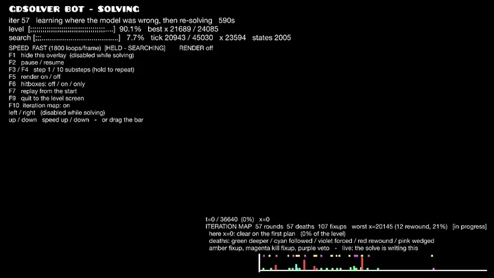
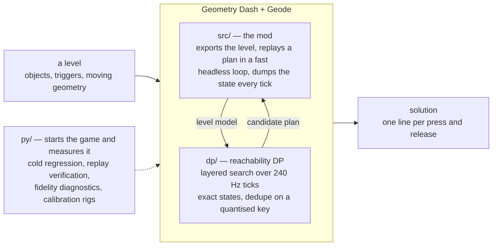
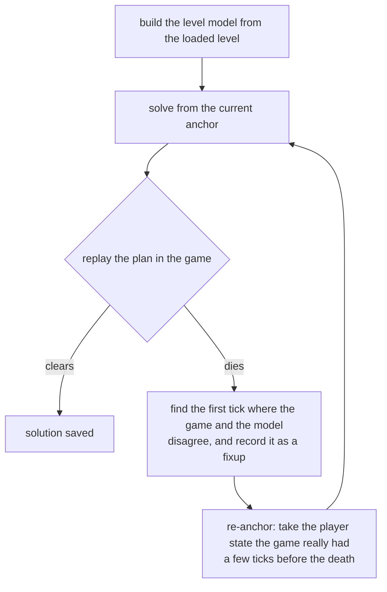

# gdsolver

**An automatic TAS solver for Geometry Dash** (2.2081, Windows / Steam). It
solves a level by playing it — inside the game, from cold.

<p align="center">
  
</p>

<p align="center"><sub>
  The last five seconds of solving <b>Dash</b>, then the first seven of the
  replay. The overlay is the loop's own: which round it is on, how far the best
  plan has reached, how far the search has got. The screen is dark because the
  search is running — the frames go to the fast loop instead — and it comes back
  when a candidate has actually cleared.
</sub></p>

Give it a level and it finds an input sequence that clears it. It does not
re-implement the game's physics: an approximate, measured-where-it-matters model
drives a **reachability DP** (which `(y, velocity)` states are reachable at every
physics tick), and the game itself — running inside a **Geode mod** — is the
verifier that decides whether a candidate plan really clears. Where the replay
diverges from the model, the solver re-anchors on the game's own state and
continues from there.

**All 22 official levels are solved cold** — no seeds, no previous solutions, no
external ground truth — by the loop inside the game, with nothing installed but
Geometry Dash, Geode and this mod. Pick **Solve** on the panel and it builds the
level, searches, replays the candidate, and repairs the plan wherever the game
disagrees with it; no external process is involved. Most levels take under a
minute. The solutions are tracked in [`data/`](data/) as
`solution_lv<N>_dp.txt`, one `input=<tick>,<0|1>` line per press or release.

Those 22 are also the supported set — see [What's next](#whats-next) for where
custom levels and coins stand.

## Results

The whole table is one cold regression run — `python py/cold_regress.py`, one
game session per level, no plan and no solution file to start from — and it is
run again on every change that reaches the loop.

| # | Level | Repairs | Time | | # | Level | Repairs | Time |
|--:|---|--:|--:|---|--:|---|--:|--:|
| 1 | Stereo Madness | 0 | 17 s | | 12 | Theory of Everything | 3 | 13 s |
| 2 | Back On Track | 1 | 13 s | | 13 | Electroman Adventures | 0 | 15 s |
| 3 | Polargeist | 0 | 14 s | | 14 | Clubstep | 7 | 30 s |
| 4 | Dry Out | 0 | 12 s | | 15 | Electrodynamix | 2 | 19 s |
| 5 | Base After Base | 3 | 16 s | | 16 | Hexagon Force | 55 | 4 m 13 s |
| 6 | Can't Let Go | 0 | 12 s | | 17 | Blast Processing | 1 | 25 s |
| 7 | Jumper | 2 | 23 s | | 18 | Theory of Everything 2 | 8 | 40 s |
| 8 | Time Machine | 1 | 19 s | | 19 | Geometrical Dominator | 18 | 1 m 34 s |
| 9 | Cycles | 3 | 16 s | | 20 | Deadlocked | 37 | 6 m 55 s |
| 10 | xStep | 6 | 27 s | | 21 | Fingerdash | 30 | 3 m 47 s |
| 11 | Clutterfunk | 1 | 18 s | | 22 | Dash | 57 | 7 m 48 s |

**Repairs** is how many times the loop had to go back: solve, replay, die,
re-anchor on the game's real state, solve the tail. `0` means the very first
plan the DP produced cleared the level. The count is deterministic for a given
build, which is why it is what `py/cold_regress.py` compares against
`data/cold_baseline.json`.

It is not a fidelity score. It counts what the loop had to do, and that depends
on which corridor the search happens to walk as much as on where the model is
wrong — the search is deepest-first, so touching one rule reorders the frontier
and the run takes a different route. Making the model *more* correct can raise
it: closing a route the model only believed in sends the search off to find the
real one.

**Time** is one run (2026-08-29), each level solved on its own — one game session
at a time, 8 solver threads, 16-core desktop — and it counts everything from
launching the game to the solution being written. The whole suite takes 30
minutes that way. Read it as a guide and not as a contract: the clock is not what
the regression compares, the repair count is, and only that one is deterministic.
Solving four levels at once — which is how the suite is normally run — costs each
expensive level 34–49 % more search time and moves none of the counts.

Almost all of it is the search. Broken down on the 2026-08-27 run, the DP calls
were 86 % of the total and 88–93 % on the four expensive levels; on the ones that
finish inside half a minute, most of what is left is starting the game and
loading the level. That split has not been re-measured since — the suite wipes
each session's log before the next level, so it needs its own run — but nothing
about where the time goes has changed.

## How it works



Geometry Dash auto-scrolls, so the player's x is a function of the tick alone
and the only decision per physics tick is *pressed or not*. Clearing a level is
then a reachability question over `(tick, y, vy, mode, gravity, size, ...)`, and
two properties make the game usable as the oracle for it: the physics are
deterministic under *click on steps*, and x is a clock, so re-anchoring the
search on a later tick costs nothing. That is the whole loop:



A *fixup* is the model agreeing to be wrong: from then on, whenever it meets
that same state again it applies the game's result instead of its own. Dead
bands, touch triggers that must be entered, ladders of anchor depths and
phantom-death detection exist for the other cases where the model is blind.
Every run is cold, and a run's fixups live only in that run.

There is also a **section solver**, which drops the model for one stuck section
and lets the game itself be the transition function, searching forward from a
practice-mode checkpoint. It is deliberately *not* part of the loop above:
nothing starts it on its own, it does not splice its answer back into the plan,
and it ends the run when it finishes. It is a tool for interrogating one wall by
hand, and no official level has needed it —
[`docs/ARCHITECTURE.md`](docs/ARCHITECTURE.md#31-the-section-solver) has the
mechanism, its costs, and the kind of death it cannot see.

* **`dp/`** — the solver core (`leveldp`, also linked into the mod). States are
  *exact*; the per-layer hash only deduplicates and never snaps a state, so every
  surviving path is a replayable plan. The DP is a candidate generator — the
  proof is always a plain replay in the game. Its physics rules are measured
  against the game (calibration levels, traces, disassembly), not fitted.
* **`src/`** — the Geode mod: level export, input injection, the per-tick state
  dump, moving-geometry recording, the fast headless loop, and the repair loop
  itself (`src/mod/repair.hpp`). It also blocks achievements and statistics
  while it is driving.
* **`py/`** — development tools; nothing here solves. The cold regression over
  all levels (`cold_regress.py`), replay verification, fidelity diagnostics,
  calibration-level generation, and an MCP server for probing the running game.

[`docs/ARCHITECTURE.md`](docs/ARCHITECTURE.md) has the long version.

## What's next

**Custom levels — unsupported today, partial support planned.** Nothing in the
loop is specific to the official levels: level selection is the game's own, the
level model is built out of whatever `PlayLayer` loaded, and plenty of custom
levels already solve as they are. They are nonetheless **not supported**: the
difference between "it worked" and "it is expected to work" is the whole gap. The
physics model is measured against what the official levels actually use, so a
level that leans on an object, a trigger or a gameplay mode the model has never
met is a level the model is wrong about — and being wrong is expensive here: the
loop finds out only by dying in the replay, and repairs one disagreement at a
time. The regression covers the official levels only, so nothing else is being
kept honest. The work is to pick a subset that is genuinely supported, say
plainly which objects are in it, and make a level outside it fail loudly instead
of slowly.

*What to expect, roughly.* The official suite is 1.x apart from two levels —
Fingerdash is 2.0 and Dash is 2.2 — so that is the era the model has been
measured against, and the repair counts in the table above are the visible half
of it: the earliest levels need 0 to 3 rounds, and the four most expensive are
all late ones. The expectation for custom levels follows: one built out of
early-era parts stands a good chance, a recent one much less.

Read that as a claim about *parts*, not about dates. What costs rounds is a
mechanic the model has not been measured against, and mechanics arrived with
versions, which is the only reason the era works as a proxy at all — and the
order does not actually follow the versions. Dash, which is 2.2, is the most
expensive at 57 rounds; Hexagon Force, which is 1.6, is right behind it at 55,
and it costs that because of its dual section; Fingerdash, in between at 2.0,
needs 30, and Blast Processing, two versions after Hexagon Force, needs 1. A 2.2
level that happens to be a plain cube level may well solve on the first plan,
and a 1.6 level with a dual may not.

**Coins.** The objective today is "reach the end alive", so a solution picks up a
coin only by accident. The level export always records where the coins are, and
there is a pickup test that does not consult GD's own coin state, so it still
works while every award is blocked — though that test is off unless asked for
(`coinMode`), because nothing in the solve needs it yet. What is missing is the
search: it does not route through them. Making coins an objective means carrying
"which coins are taken" in the
search state, and accepting that the cheapest route to the end is usually not a
route that passes every coin. Coins collected while the mod drives are never
awarded (see [Safety](#safety--community-notes)) — a coin route is a TAS result,
not progress on a save file.

## Installing

Grab **[`gdsolver.geode` from the latest release](https://github.com/gdsolver/gdsolver/releases/latest)**
and drop it into Geometry Dash's `geode/mods/` folder, then start the game — the
usual place is

```
C:\Program Files (x86)\Steam\steamapps\common\Geometry Dash\geode\mods\
```

Geode itself has to be installed first ([geode-sdk.org](https://geode-sdk.org)).
The build is for **Windows and GD 2.2081**; Geode refuses to load it on anything
else rather than misbehaving. Nothing else is needed — no Python, no external
process, no second copy of the game.

The mod announces itself in the log the moment it loads, and says what it
suppresses:

```
gdsolver: loaded. While the bot drives -- solving or replaying -- achievements,
statistics, coins and the level's own record are all blocked. Your own attempts,
with the bot idle, record as usual.
```

Installing it does **not** cost you your progress: the block is tied to an
automated session being open, not to the mod being present. See
[Safety](#safety--community-notes).

## Building

Requirements: Visual Studio 2022 (C++ desktop workload), CMake ≥ 3.21, the
[Geode SDK](https://geode-sdk.org) (`GEODE_SDK` environment variable) and
Geode CLI for the mod.

```powershell
# solver CLI only (no Geode needed)
cmake -S . -B build-dp -DGDSOLVER_BUILD_MOD=OFF
cmake --build build-dp --config Release        # -> build-dp/dp/Release/leveldp.exe

# mod + CLI
geode build                                    # -> build/gdsolver.geode
```

## Watching a run

A small panel appears on the screens a level is started from — the main-level wheel, and any
individual level's own page, so custom levels included. It switches between three modes:
**Normal** (the game as it is), **Replay** (replay a stored solution for the level), and
**Solve** (solve the level in-process). Level selection itself is the game's own, so any level
can be picked. The panel is on those screens and nowhere else: everywhere else it would just
sit on top of the menu underneath it.

**It runs fast, dark and silent until it has something to show.** Candidate replays mostly
die and each one at normal speed would cost the length of the song, so the screen goes to the
fast loop and stays there. When a candidate finally clears, the level restarts and the solution is
played through properly — at 1x, with the artwork and the music. That is the run worth watching,
and it is the only one you are shown. (`F5` overrides this in either direction.)

While a level is on screen the mod draws a column down the top-left: a badge naming the run,
what the solve is doing, and the keys with the current speed:

```
iter 3   solving the tail from GD's own state   72s
level  [########............]  41.2%   best x 11372 / 27985
search [##############......]  72.4%   tick 18096 / 25000   x 19300   states 16000
```

Two bars, because they answer different questions. **level** is how far into the level the run has
actually got — the deepest point a replay reached — so it only ever grows, and it is the same
yardstick as the game's own percentage. **search** is how much of the current search is left;
reaching its end is the search finishing, which is not the same event as reaching the end of the
level. The keys are:

| key | |
|---|---|
| `F1` | hide the overlay. Refused while solving, and it never hides the bot badge |
| `F2` | pause / resume — `F3` / `F4` step 1 / 10 substeps (held down they repeat) |
| `F5` | rendering on / off. Only in a solve: there the frames go back to the fast loop, which is most of the speed. In a plain replay it does nothing — a replay you cannot see is not a replay |
| `F6` | hitboxes: off / on / **only** (the game's own debug drawing; "only" hides the artwork so nothing is left but the geometry the physics uses) |
| `F7` | replay from the start — works after the replay has finished too |
| `F9` | quit to the level screen |
| `F10` | the iteration map: where the repair loop spent its rounds (below). On during a solve, off in a replay, and this flips whichever it currently is |
| `←` `→` | seek back / forward. A tap is five seconds; holding accelerates. While the game is stopped they step a frame instead. Refused during a solve: the level is the loop's own verification replay and nudging it would spoil the round |
| `↑` `↓` | spectating speed, one notch (0.25x … 16x). Physics stays at 1/240 either way, so the trajectory and the tick numbers do not change |

There are no keys that let a player do what the game does not allow: no warp, no noclip, no forced
mode, no infinite jump. The overlay is for watching a run, not for changing one.

A **seek bar** sits in the bottom-right of every replay. Click or drag it to go somewhere; the
level fast-forwards there (restarting first if you asked to go backwards, since a forced-scroll
game has no reverse) and hands the speed back exactly where it found it. It works on the results
screen too, which is when you most want it. `←` / `→` do the same thing in five-second steps.

The level is blacked out while it fast-forwards, with a `▶▶▶` indicator: the picture is running at
hundreds of physics steps a frame and is not worth looking at. Rendering is *not* switched off for
this — resuming it is the path that restarts the level (and crashes on the way back), so the level
is painted over instead.

### The iteration map (`F10`)

"Cleared in 62 rounds" says nothing about *where* the rounds went, and they are never spread
evenly: a level is usually solved by the first plan for nine tenths of its length, and then the
loop grinds against two or three walls. The map draws that distribution back onto the level — live
while the solve is still running, which is where it is on by default, and over a replay of the
solution, where `F10` asks for it:

* a **column** at every place a replay died, its opacity the share of the run's worst wall and the
  round count printed above it;
* the **death** itself, coloured by how the loop scored that round — green deeper (progress),
  cyan followed, violet the forced portal route, red rewound (stuck), pink wedged;
* a **fixup** in amber (magenta for a kill record) wherever the *model* was wrong. This is the
  cause the deaths are the symptom of, and the two are often hundreds of pixels apart;
* the **path each round flew** from its re-anchor to its death. Rounds share the verified prefix
  by construction, so they are one line until the splice point and a fan after it — and the fan
  is the wall;
* the same histogram inside the seek bar, so the whole level's shape is readable at once.

The data is the loop's own: it writes `itermap_lv<N>.txt` next to the solution when it clears, and
also when it gives up — a run that did *not* clear is the one whose map is worth reading. Runs made
before this existed can be recovered from their logs, which hold the same lines:

```bash
python py/itermap_from_log.py --all
```

```bash
python py/watch_plan_replay.py --level 22 --itermap
```

What each mark means, and how to tell a wall the *model* gets wrong from a wall with no route
through it, is in [docs/ITERMAP.md](docs/ITERMAP.md).

A solve makes no sound while it is solving: it runs hundreds of attempts a minute with the physics
tens of times faster than the song, so every note lands in the wrong place. The sound comes back
with the picture, for the showing of the solution and for any plain replay, and the song is then
kept with what is on screen — pausing the game pauses it, and the spectating notch retunes it up
to 4x (past that it is paused and re-seeked on the way back down).

## Safety / community notes

This is a TAS and research tool, not a way to fake records.

* **While the mod is driving — solving or replaying — nothing is recorded**:
  achievements, statistics and coins are blocked, and so is the level's own
  record (completion percentage, normal/practice best, attempts, jumps, orbs,
  diamonds, the secret key, coin achievements). GD's own "do not record" path
  is used for the block — the flag it sets when a level is played from a start
  position — and the counters GD advances outside that path (the level's
  attempt and jump counts) are put back afterwards.
* **Playing it yourself records normally.** The suppression is tied to an
  automated session being open, not to the mod being installed, so with the mod
  loaded but idle your own attempts, progress and achievements count as usual.
* Every session ends with the evidence in its log: how many recordings were
  blocked, and a `level record changed:` line that names any field that moved.
  It should read `none`.
* Replays driven by the mod are marked as bot input.
* The level-data dumps of the official levels that the development workflow
  uses are not part of this repository; the mod regenerates them from your own
  copy of the game.

## License

MIT — see [LICENSE](LICENSE).
