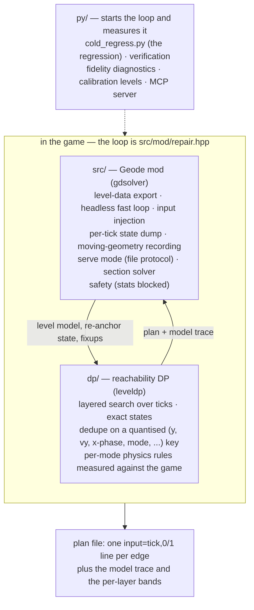
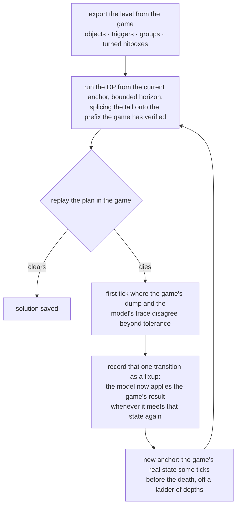

# Architecture

This document describes how gdsolver finds an input plan for a level and which
component owns which part of the job. The loop runs in-process — Geometry Dash,
Geode and the mod, nothing else — which is what §4 is about.

## 1. The problem

Geometry Dash gives the player no steering input: the level sets the forward
speed (speed portals included), so the only decision per physics tick
(240 Hz) is *pressed or not*. The state that matters is
`(tick, y, y-velocity, mode, gravity, size, ...)`, and clearing a level is a
reachability question: is there a sequence of presses under which the player
is alive at the end?

Forward position is *nearly* the clock rather than exactly it, and both exceptions
are visible in the search key. GD's stair snapping leaves a sub-pixel phase —
landings differ by 0.3 to 1.0 px, and one of those decides whether the next landing
falls on tick n or n+1 — so `xAbs` is keyed at a quarter pixel (`search_key.hpp`,
measured on lv11 x=24,863, where the only route lands at 24863.4 and jumps on the
very next tick). And a 2.2 rotation section turns the whole gameplay frame, so
world x can freeze for a stretch while the frame's own forward axis keeps advancing
— lv22's reference trace at t=16,995..17,005 holds x at 20085.0996 while y climbs
1.95 a tick under `gframe=3` (`frames.hpp`); the model holds its state in the
current frame's coordinates so that every rule stays written as "x is the clock,
y is height". Neither exception
hands the player an axis to steer with, and that — not "x is the tick" — is the
property the formulation rests on. A platformer level does hand one over, which is
why those are out of scope rather than merely unmeasured.

Two facts make the game a usable oracle for that question:

* **Determinism** — with input precision set to *click on steps*, the same input
  sequence yields the same trace, independent of frame rate, window size or
  graphics settings. This is measured, not assumed; everything below rests on it.
* **x is essentially a clock** — re-anchoring the search on a later tick costs nothing in
  terms of path choice, so a plan can be verified in the game and repaired
  from the first point of disagreement.

## 2. Components

One round trip per iteration: the mod hands the solver the level and, after a
replay that died, the game's own state to restart from; the solver hands back a
plan and the model trace the next divergence is measured against.

### 2.1 `dp/` — the solver core

* `dp/src/dp/*.hpp` is one translation unit split into modules in dependency
  order, each header including the previous one: the speed tables and per-mode
  constants, then geometry (hitboxes, OBB/SAT tests, rotated gameplay frames),
  then the world (moving geometry, triggers, level loading), then `step` — the
  per-tick physics step — with `fixup` and `cli` on top. `dp/src/leveldp_main.cpp`
  is a three-line `main` around `dp::cliMain`, and the mod calls that same
  function in-process: the CLI and the mod run one solver, not two.
* The level comes in as an objrects CSV through `loadLevelFrom(std::istream&)`.
  Setting `dp::g_levelCsv` makes it read a buffer instead of a file, which is
  how the mod solves a level it never wrote to disk.
* States are **exact** (double y / vy plus discrete flags). The per-layer hash
  only deduplicates; it never snaps a state, so every surviving path is a
  replayable plan. The DP is a candidate generator; the proof is always a plain
  replay in the game.
* A cell keeps **two** representatives, the highest and the lowest `vy` in it.
  First-wins was tried and kept the slowest lineage in every cell, which
  strangled climbs (a ship's climb rate collapsed to ~0.02 vy/tick); keeping one
  extreme instead discarded the dive-recovery lineages. Both extremes is what
  survives both.
* When several states reach the goal, the plan emitted is the one whose **route
  kept the most room**, not the one that happened to be enumerated first. Each
  state carries `tight`: how many ticks its lineage spent with less vertical
  clearance than the model's own error. It is carried rather than recomputed —
  clearance at the goal itself says nothing, because every state that gets there
  is in open sky — and it is deliberately *not* part of the dedupe key, being a
  property of how a state was reached rather than of the state. Ties keep the
  incumbent, so a level where nothing is tight emits exactly what the old rule
  did.
* Output contracts: `SOLVED at ...`, `PARTIAL: frontier died at t=.. x=..`,
  `FAILED: ...` on stdout; files `<out>` (the plan, `input=<tick>,<0|1>` lines),
  `<out>.trace.csv` (per-tick model state) and `<out>.bands.txt` (per-layer
  frontier width).

### 2.2 `src/` — the Geode mod

* `src/mod/*.hpp` — the infrastructure, again a header chain: configuration
  (`autorun.cfg` keys), the trace/dump/result writers, hotkeys and the overlay,
  command polling, crash post-mortem, the stall watchdog, plan I/O and the
  session lifecycle.
* `src/mod/hooks_*.cpp` — one translation unit per hook group: system
  (achievement and statistic blocking, music, focus), menu, game layer (tick
  control, the fast loop, tracing), player (state dump) and play layer (attempt
  boundaries, checkpoints, death and completion).
* `src/solver/*.hpp` — level-data export, moving-geometry recording
  (grouptrace), the clearance table, the raw player snapshot and the section
  solver (§3.1).
* `src/mod/itermap.hpp` — what the repair loop's rounds cost, and where. Each
  round's death, each fixup and each veto is recorded as the loop makes it,
  filed as `itermap_lv<N>.txt` when the solve ends either way, and drawn back
  over the level — during a solve by default, in a replay when `F10` asks.
  Recording only: nothing in the loop
  reads it back. `py/itermap_from_log.py` rebuilds the same file from a run's
  log, so runs made before it existed are readable too. How to read what it
  draws: [ITERMAP.md](ITERMAP.md).
* Protocol, per data root: `autorun.cfg` (session config and plan),
  `plan_in.txt` / `cmd.txt` (the next plan, live commands), `result.txt`
  (session results, one line per event), `dump.csv` (per-tick player state),
  `grouptrace*.txt` (moving geometry), `itermap_lv<N>.txt` (the iteration map).
* `src/mod/dp_bridge.{hpp,cpp}` — the one translation unit that compiles the
  solver core inside the mod. It mentions neither Geode nor cocos; everything
  crosses the boundary as plain C++. `dpselftest=1` reports what the core made
  of the level, in the CLI's own words, so the two can be compared line for
  line.
* `src/mod/repair.hpp` — the solve loop itself (§3), in the game. cfg
  `dpsolve=1` builds the level from `PlayLayer`, solves it on a worker thread,
  replays the plan, and when the replay dies re-anchors on the player state it
  recorded tick by tick and solves the tail from there. The anchor record is
  read straight off `PlayerObject` as the replay runs, not parsed back out of
  `dump.csv` — being in-process is what makes that possible.
* Safety: while the mod is *driving* — solving or replaying — achievements,
  statistics, coins and the level's own record are all blocked; a human playing
  with the mod merely loaded records normally. The count of blocked events and
  a `level record changed:` line are printed at session end.

### 2.3 `py/` — tools

Nothing here solves. The loop lives in the mod; `py/` starts it and measures it.

* `cold_regress.py` — the cold regression: every level solved from nothing by
  the game's own loop, on a pool of isolated GD workers.
* `verify.py` / `verify_solutions.py` — replay every solution in the game;
  `quick_regress.py` — a fidelity regression that needs no worker at all;
  `fixcensus.py` / `fixfam.py` / `fidelity_diff.py` — where and why the model
  and the game disagree; `mklevel.py` + `calib_units.py` — calibration levels
  that measure one physics rule across all modes; `gdtas/` — worker
  provisioning, control and the shared readers; `mcp/` — an MCP server exposing
  the same protocol for interactive probing.

## 3. The solve loop (one level)

The first pass runs from tick 0; every later one starts at an anchor and splices
onto the prefix the game has already verified. What the diagram leaves out are the
mechanisms for the cases where the model is *blind* rather than merely inaccurate:
dead bands, touch triggers that must be entered, a ladder of anchor depths and
phantom-death detection. All of those the loop drives itself. The section solver
in §3.1 is not one of them — it is started by hand and ends the run.

Every run is *cold*: no seeds, no previous solutions, no external inputs. The
fixups of a run live only in that run.

### 3.1 The section solver

**Read this section knowing what it is not.** The section solver
(`src/solver/secsolve.hpp`) is not a rung of the loop in §3. Nothing starts it
automatically; it is asked for by hand, through cfg keys at session open or the
runtime command `secsolve <startTick> <targetX>`. It does not splice its answer
back into the plan, and it does not hand control back — the search drives the
world arbitrarily and ends the session itself. **No official level has needed
it**; the automatic mechanisms above have covered all 22.

What it is, then, is the instrument for interrogating one wall: a way to ask the
game directly whether a stuck section is passable at all, when the model says it
is not and there is no telling whether the model is right.

A fixup is local: it applies where the model meets that exact state again, and
nowhere else. Generalising a divergence into a *rule* takes measurement and
judgement, so on a section the model is simply wrong about, the loop can grind —
and the question worth answering first is whether anything gets through there.

For one stuck section, the section solver drops the model and lets **the game be
the transition function**. That is affordable only because the section makes the
question a narrow one:

* the **entry** is fixed — the section starts at a practice-mode checkpoint, not
  at a state the search has to reach;
* the **exit** is binary — the target was crossed alive, or it was not;
* the **horizon** is short — a few hundred ticks.

So there is no fitness function to choose, which is what makes searching against
the real game tractable here and not in general.

**A node is a plan, not a snapshot.** One checkpoint is kept, for the section
entry. A node is the input sequence from that entry, and every expansion rebuilds
it: restore, replay the prefix, branch. A checkpoint per node would mean holding
all object state for every live state in the layer, which does not fit; a restore
costs about 2 ms and replaying a prefix is far cheaper than that, so rebuilding is
the affordable half of the trade. A few hundred layers at a hundred states each is
minutes — practical exactly as long as it stays section-limited.

The search is per-layer breadth-first with a quantised dedupe and cap truncation,
deliberately the same shape as the DP so that truncation behaves the way it does
there. The dedupe grid is fine on purpose and must not be coarsened: a bucket
keeps its first arrival and insertion order puts the lower branches first, so a
coarse grid silently discards the top of the reachable band.

The exit does not have to be x. In a rotated section travel is along -y and
pressing moves x, so the goal can also be written in y (with a direction) or in
survived depth; the enabled tests are OR-ed.

Two ways in: cfg keys at session open, or the runtime command
`secsolve <startTick> <targetX> [horizon] [cap]` during an in-process solve. The
second retires the repair loop, replays its deepest *verified* plan to the section
head, drops the checkpoint there and hands over — one-way, because the search
drives the world arbitrarily and ends the session itself.

**What it cannot see.** A branch is one restore plus one step, so a death the game
only reaches by accumulating state across consecutive ticks — an out-of-bounds
latch that wants two of them, a one-shot trigger the restore puts back — is reset
before it can fire. The search then believes a lethal corridor is passable, and
its own cross-check of the leaf refuses the answer. An `UNVERIFIED` leaf is that
guard working rather than a bug to chase: where every death in the section is
decided within one tick, the same machinery verifies clean.

That is not hypothetical. The first time the handoff was pointed at a real wall on
a custom level, it came back `UNVERIFIED`: the checkpoint restore was faithful to
three decimals, but the two-tap sequence the search had found died well short of
the target on independent replay, at every input phase, with `killer: obj=NULL` —
an object-less kill, which is exactly the accumulating kind. The guard held; no
false plan was spliced. The level was cleared later by fixing the model instead.

## 4. Running inside the game

A user needs only Geometry Dash, Geode and `gdsolver.solver.geode`:

* **`dp/` is linked into the mod.** The level model is built in memory from the
  loaded `PlayLayer` by the same code that writes the text exports, and a solve
  in the game produces a plan byte-identical to the CLI's.
* **`src/mod/repair.hpp` holds the loop** — solve → replay → learn → re-anchor →
  splice → replay — in the game, with no external process. All 22 official levels
  solve cold this way (`py/cold_regress.py`).

Acceptance for a change is behavioural identity where identity is claimed: the
CLI must produce byte-identical plans and traces on a fixed suite
(`py/quick_regress.py`), and the loop must reproduce the cold-run fingerprint —
iteration, plan hash, death tick and x, fixup hash. The loop prints those itself
(cfg `dpfingerprint`), and `py/cold_regress.py --bless` records the per-level
iteration counts they belong to. The iteration count is the number to compare;
the wall clock is not deterministic and is never the criterion.

The two halves of that measure different things, and the section suite does not
predict the loop. It anchors on the game's real state every few hundred ticks
and asks how long the model tracks from there, so it sees physics and nothing
else. The loop's iteration count also carries which corridor the search walked,
and the search is deepest-first: one rule can close four sections and leave the
count untouched, or improve the physics and double it by sending the run down a
different route. Both have been measured on the same change. Read the section
suite as "did the physics move", never as "is this an improvement".

## 5. What the model covers

The DP's rules are measured one at a time against what the official levels
actually use — calibration rigs, traces out of the game, the disassembly. That
measuring is also the boundary of what is supported.

* **Custom levels** go through the same path: level selection is the game's own
  and the model is built from whatever `PlayLayer` loaded, so many of them solve
  as they are. Nothing keeps them honest, though. An object, a trigger or a mode
  the model has never met is a disagreement the loop can only discover by dying
  in a replay, and it repairs one disagreement per iteration — so an unmodelled
  level does not fail, it crawls. The corpus the boundary was measured on is
  almost entirely 1.x, so a level built from early-era parts has the better
  chance — but the predictor is the mechanics a level uses, not its date, and
  the two only correlate because mechanics arrived with versions. A supported
  subset has to be defined in objects and modes; a version is a first guess at
  which of them a level contains.
* **The objective is survival**: alive at the end of the level, nothing else.
  Where the coins are is always exported, and there is a pickup test that never
  consults GD's own coin state, so it still works while every award is blocked —
  but it is off unless `coinMode` asks for it, because no part of the solve reads
  it. Coins are not in the search state, and a plan that collects one did so by
  accident.
