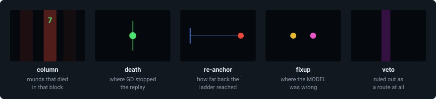
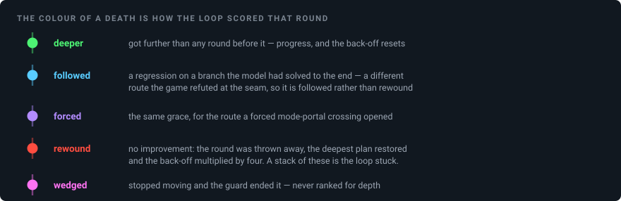
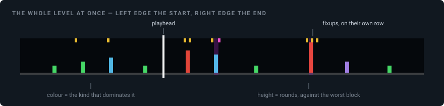

# The iteration map

`F10` in a replay. Off by default. (The transport it shares a corner with — the seek bar, the
arrow keys — is in the [README](../README.md#the-iteration-map-f10-off-by-default); this document
is about reading what the map draws.)

A cold run reports one number — *cleared in 62 rounds* — and that number says nothing about
**where** the rounds went. They are never spread evenly. A level is solved by the first plan for
nine tenths of its length, and then the loop grinds against two or three walls. The map draws that
distribution back onto the level it belongs to, so the question stops being "how many rounds" and
becomes "which wall, and why that one".

Everything it shows is something the repair loop already knew and used to only write to a log.

## The marks



The marks are children of `m_objectLayer`, so they pan, zoom and rotate with the level — inside
lv22's rotated shaft they tilt with the world, which is the only way a mark at x=3,497 is still at
x=3,497.

**Column.** One GD block wide (30 px). Its opacity is that block's share of the run's worst block,
so the picture answers *where did the rounds go* rather than *was anything ever wrong here*. It
tops out under a third opaque: the column has to be findable without hiding the geometry you came
to look at once it has told you where to look. From two rounds up the count is printed above the
marks — opacity alone cannot tell 11 rounds from 3, and the figure is the thing you actually
compare. No figure means one round died there.

**Death.** The dot sits where GD had the player when it killed them — `destroyPlayer`'s own
argument, not the recorder's last row, which is one tick short of that and on a fast fall tens of
pixels out. Its colour is how the loop scored the round; see below.

**Tail.** The path the round actually flew, from the anchor it was spliced at to where it died,
with a tick at the anchor end. **Its length is how far back the ladder had to reach**; tails that
grow over successive rounds at one wall are the back-off escalating — 6 → 24 → 96 → 384 → 1536
ticks — which means every shallower anchor was doomed.

Only the tail is drawn, and that is not an economy. Every round keeps the prefix the game has
already verified and re-solves only what comes after, so the rounds are the *same* trajectory up
to their splice point and differ only past it. Drawn whole they would be one line sixty times
over with a fan at the end; drawn as tails they are the fan, which is the part that says anything.
Where several rounds took the same line the faint tails overlap into a brighter one on their own.

**Fixup** (magenta for a kill record). The first tick of that replay where the model and GD
disagreed. This is **where the model was wrong**, and it is the cause the deaths are the symptom of.
The two are routinely hundreds of pixels apart.

**Veto.** A phantom veto box: a stretch where a tail the model had SOLVED died in the game
repeatedly, so the loop declared it not a route and forbade the search from planning through it.
Only the x extent is drawn — the real box also constrains y and mode, but drawing that shape would
read as "the route goes around here", which is the one thing a veto does not claim.

## The colours

Ten deaths in one place mean opposite things depending on this. It is the difference between the
loop working through a hard section and the loop stuck against a wall.



Two of them are worth spelling out. **followed** exists because rewinding onto a branch the model
already knows dies is worse than following one it believes in; the loop gives such a branch four
rounds of grace. **wedged** is never ranked for depth on purpose — ranking it would score any route
that dawdles before freezing at the same dead point above every honest death in the level, and the
sterile plan would then own the deepest slot forever.

## In the bar



The seek bar is always there; `F10` adds this layer to it. Deaths are the bars, fixups a separate
row along the top edge — they are a different question and must not be added into the same bar.

## Reading it

The order matters: find the pillar first, then decide what kind of pillar it is.

1. **Look at the bar.** Is the budget in one pillar or spread out? Spread means the fidelity is
   generally poor; concentrated means a specific wall.
2. **Find the red pillars.** Green and cyan ones cost rounds but made progress.
3. **Are there amber dots *at* the pillar?** Then the wall itself is a fidelity hole — the model is
   wrong right there.
4. **If not, where are the amber dots?** Fixups well upstream with none at the pillar mean the wall
   is downstream of a drift, and the wall is a symptom. The cause not being at the place you want
   to fix is the normal case, not the exception.
5. **How long are the blue lines at the pillar?** Long ones mean the ladder exhausted its shallow
   anchors: the route has to change further back, not be repaired in place.
6. **Purple wash?** The loop already ruled that stretch out. If the real route goes through it,
   that is a bug in the veto (`liftPhantomVetoes` is the last-resort insurance).

## What that looks like on the real runs

Aggregated from `data/itermap_lv*.txt`. The same size of pillar diagnoses opposite things.

| pillar | deaths | kinds | fixups within 90 px | anchor reach min/med/max | reading |
|---|---|---|---|---|---|
| lv16 x=19,725 | 11 | rewound 10 | **0** | 156 / 602 / **2,098** | route |
| lv21 x=14,625 | 15 | followed 9, rewound 5 | **26** | 9 / 105 / 3,117 | model |
| lv22 x=20,145 | 12 | rewound 7, followed 4 | **22** | 47 / 47 / 332 | model |
| lv22 x=9,825 | 8 | rewound 7 | **2** | 9 / 154 / 1,347 | route |

lv16's x=19,725 is the textbook case. Eleven deaths, ten of them rewound — and not one fixup within
90 px, so the model was right about the physics there. The back-off ran all the way up
(6 → 96 → 240 → 384 → 1536) and the ladder ended up anchoring 2,098 px upstream. That is the
signature of *the model is right and there is no route*, and the place to fix it is not that
pillar. lv21's x=14,625 is a pillar of the same size with 26 fixups sitting on it: there, the wall
is the fidelity hole, and the place to fix it is exactly where the pillar stands.

## Where the data comes from

The loop records each death, fixup and veto as it makes them (`src/mod/itermap.hpp`), and writes
`itermap_lv<N>.txt` into the session's data root when the solve ends — on a clear, and **also on a
give-up**, because a run that did not clear is the one whose map is worth reading. Recording only:
nothing in the loop reads the map back, so whether the overlay is on cannot change what the solver
does.

Runs made before the map existed are not lost. Their logs hold the same lines, and
`py/itermap_from_log.py` rebuilds the file from `data/coldlog_lv*.txt` or
`data/solvelog_live_lv*.txt`:

```bash
python py/itermap_from_log.py --all
```

Maps rebuilt that way carry `approx=fixup_y`, because the `[fixup]` log line has an x but no y —
the fixup is then drawn at the y of its own round's death. Its x, the part that says where the
model was wrong, is exact either way.

To watch a replay with the map already on:

```bash
python py/watch_plan_replay.py --level 22 --itermap
```

## The file

`key=value` lines, in the style of the plan files.

```
# gdsolver iteration map
level=22
rounds=62
cleared=1
death=<round>,<tick>,<x>,<y>,<kind>,<anchorTick>,<anchorX>,<backoff>,<killerId>,<killerUid>
fixup=<round>,<tick>,<x>,<y>,<kill>
veto=<round>,<x0>,<x1>
path=<round>,<kind>,<x>,<y>,<x>,<y>,...      one point every 8 ticks
```

`kind` is 0 deeper, 1 followed, 2 forced, 3 rewound, 4 wedged. `killerId` / `killerUid` are GD's own
verdict on the death, latched at `destroyPlayer`.
